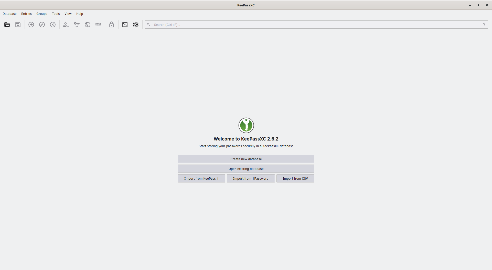
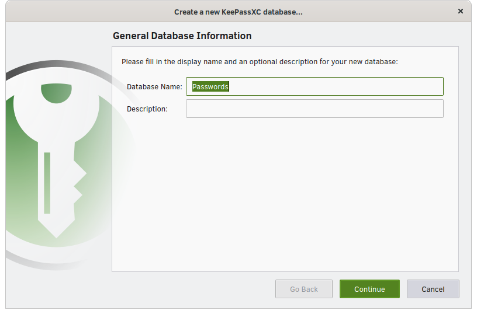
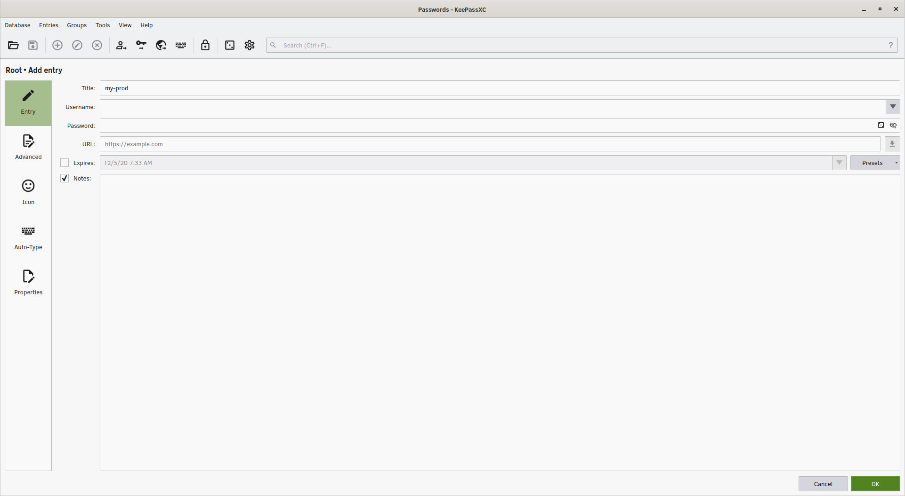
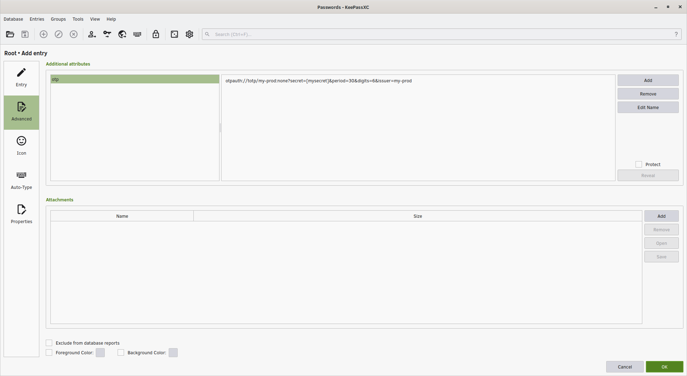

Create new database



```
# New database
ctrl-shift-n
# Continue
enter
enter
# New password
newpassword
tab
newpassword
enter
# Save
enter
```

Create new entry



```
# New entry
ctrl-n
# Title
my-prod
```



```
# Advanced
shift-tab
shift-tab
down
# Add
tab
tab
tab
enter
# New attribute
otp
enter
tab
otpauth://totp/my-prod:none?secret=[mysecret]&period=30&digits=6&issuer=my-prod
# OK
ctrl-enter
```
